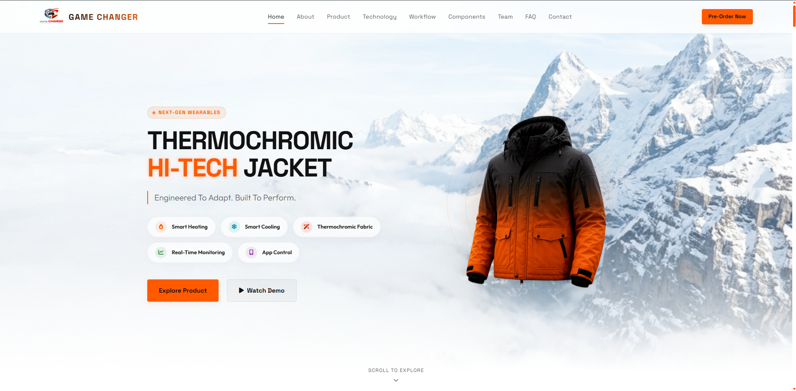

# 🧥 GAME CHANGER — THI-THU V1 Smart Jacket

> **Engineered to Adapt. Built to Perform.**

A premium, fully responsive product website for the **THI-THU V1** — the world's first intelligent climate-responsive wearable jacket with thermochromic fabric, smart heating & cooling, and Bluetooth app control.

🔗 **Live Site:** [https://game-changer-jacket.vercel.app](https://game-changer-jacket.vercel.app)

---



---

## ✨ Features

### 🌡️ Smart Climate Technology
- **Thermochromic Fabric** — Color-shifting material reacts to temperature in real time (black → orange)
- **Carbon Fiber Heating Pads** — 3 independent heating zones (Left Chest, Right Chest, Back)
- **Dual Blower Cooling Fans** — Active airflow circulation triggered by a BC547 transistor circuit
- **DS18B20 Temperature Sensor** — Continuous interior temperature monitoring via OneWire bus
- **ESP32 Microcontroller** — Bluetooth 5.0 + Wi-Fi 802.11 b/g/n control hub

### 🌐 Website Sections
| Section | Description |
|---|---|
| **Hero** | Full-screen cinematic intro with animated particle background |
| **About** | Mission, use cases, and design philosophy |
| **Product Overview** | Technical specifications and feature breakdown |
| **360° Viewer** | Drag-to-rotate interactive jacket viewer with 5 angles |
| **Thermo-Tech** | Live temperature slider with thermochromic fabric simulation |
| **Workflow** | 10-step interactive smart system workflow diagram |
| **Components** | Visual grid of all hardware components with modal popups |
| **Companion App** | Live interactive mobile app UI simulation |
| **Materials** | Premium fabric and hardware materials showcase |
| **Research** | Engineering timeline and development milestones |
| **Demo Video** | Product video section |
| **Team** | Engineering team profiles |
| **FAQ** | Accordion-style frequently asked questions |
| **Contact** | Pre-order and inquiry form |
| **Footer** | Newsletter subscribe with custom popup modal |

### 💎 UI/UX Highlights
- **Fully Responsive** — Mobile, tablet, and desktop layouts with a slide-in hamburger menu
- **Glassmorphism** effects on cards, modals, and navigation
- **Particle Physics Engine** — Custom HTML Canvas background with cursor repulsion
- **Reveal-on-Scroll** animations via IntersectionObserver
- **Interactive 360° Drag/Swipe** to rotate product viewer
- **Custom Newsletter Modal** — Premium popup replacing browser alerts
- **SEO Optimized** — Full meta tags, Open Graph, Twitter Cards, and favicon

---

## 🛠️ Tech Stack

| Technology | Usage |
|---|---|
| **HTML5** | Semantic page structure |
| **Vanilla CSS3** | Custom design system, glassmorphism, animations, responsive layouts |
| **Vanilla JavaScript** | All interactivity — no frameworks |
| **HTML Canvas** | Particle background engine |
| **Font Awesome 6** | Icons throughout the UI |
| **Google Fonts** | Space Grotesk + Outfit typography |
| **Vercel** | Deployment & hosting |
| **Git / GitHub** | Version control |

---

## 🚀 Getting Started

### Clone the repository
```bash
git clone https://github.com/mrshibly/GameChanger-Outwear.git
cd GameChanger-Outwear
```

### Run locally
No build step required. Simply open `index.html` in any modern browser, or use a local server:
```bash
# Using VS Code Live Server, or:
npx serve .
```

### Deploy to Vercel
```bash
npx vercel --prod
```

---

## 📁 Project Structure

```
GameChanger-Outwear/
├── index.html              # Main HTML page
├── assets/
│   ├── css/
│   │   └── index.css       # Complete design system & styles
│   ├── js/
│   │   └── index.js        # All interactive logic
│   └── images/
│       ├── jackets/        # Jacket view images (360°, hot/cold states)
│       ├── components/     # Hardware component images
│       └── favicon.png     # Site favicon
├── vercel.json             # Vercel deployment config
└── README.md
```

---

## 🎨 Design System

- **Primary Color:** `#FF5A00` (Vivid Orange)
- **Background:** Light aesthetic (`#ffffff` / `#f8f9fa`)
- **Headings Font:** Space Grotesk (Bold 700/800)
- **Body Font:** Outfit (Light 300 — Bold 800)
- **Breakpoints:** 1024px (Tablet) · 768px (Mobile) · 480px (Small)

---

## 👥 Team

Developed by the **Game Changer Wearables** engineering team — bridging smart fashion with embedded IoT systems. Based in **Dhaka, Bangladesh**.

---

## 📄 License

This project is for product showcase and academic/portfolio purposes.

---

*© 2026 Game Changer Wearables. All rights reserved.*
